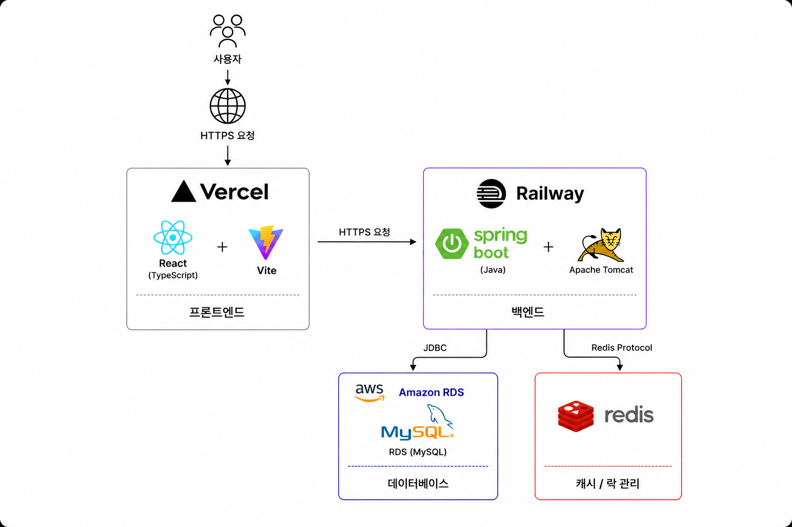
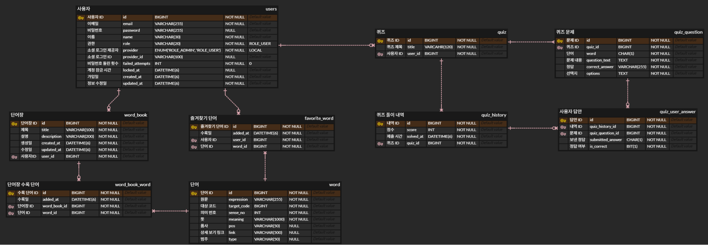

# 슬기틔움

## 1. 프로젝트 소개

### 1-1 프로젝트 개요
**슬기틔움**은 바쁜 일상 속에서 어휘력 향상, 깊이 있는 독해 훈련, 그리고 전반적인 문해력 증진을 원하는 **현대인들을 위한 맞춤형 한글 문해력 학습 플랫폼**입니다. 
AI 기반의 쉬운 말 번역과 형태소 분석을 통해 어려운 글을 빠르고 쉽게 이해하도록 돕고, 핵심 단어를 저장하여 퀴즈 및 문장 성분 분할 독해 훈련으로 실질적인 문해력을 기릅니다. 더불어, 실시간 멀티플레이어 퀴즈 게임을 통해 타인과 소통하며 재미있게 우리말 어휘를 익힐 수 있도록 설계되었습니다.

### 1-2 주요 기능 및 엔드포인트
슬기틔움이 제공하는 핵심 API 명세는 다음과 같이 역할별 표 형태로 구성되어 있습니다.

| 분류 | 메서드 | 엔드포인트 | 설명 |
| :--- | :---: | :--- | :--- |
| **인증 및 계정** | `POST` | `/api/auth/signup` | 회원가입 및 기본 검증 |
| | `POST` | `/api/auth/login` | 로그인 및 Access Token / Refresh Token (HttpOnly Cookie) 발급 |
| | `POST` | `/api/auth/refresh` | JWT Access Token 재발급 |
| | `POST` | `/api/auth/logout` | 로그아웃 처리 및 Refresh Token 쿠키 삭제 |
| | `GET` | `/api/auth/name/{name}` | 닉네임 중복 검증 |
| | `GET` | `/api/auth/email/{email}` | 이메일 중복 검증 |
| | `GET` | `/api/user/me` | 마이페이지 정보 조회 (프로필 및 학습 통계) |
| | `PATCH` | `/api/user/name/{name}` | 사용자 닉네임 변경 및 새로운 토큰 발급 |
| | `PATCH` | `/api/user/password` | 비밀번호 변경 및 자동 로그아웃 처리 |
| | `DELETE` | `/api/user` | 회원 탈퇴 및 관련 정보 삭제 |
| **스마트 번역기** | `POST` | `/api/analysis/translate` | Google Gemini API 기반 쉬운 말 번역, AI 추천 어려운 단어 및 형태소 기반 명사 추출 |
| | `GET` | `/api/analysis/search` | 국립국어원 우리말샘 OpenAPI 연동 단어 사전 상세 검색 |
| **단어 및 단어장** | `GET` | `/api/word` | 즐겨찾기 등록한 단어 목록 조회 (커서 페이징) |
| | `POST` | `/api/word` | 단어 즐겨찾기 추가 |
| | `DELETE` | `/api/word/{favoriteWordId}` | 단어 즐겨찾기 취소 |
| | `GET` | `/api/wordbook` | 사용자의 전체 단어장 목록 조회 |
| | `GET` | `/api/wordbook/{wordBookId}/words` | 단어장 내부 단어 리스트 조회 (커서 페이징) |
| | `POST` | `/api/wordbook/empty` | 빈 단어장 생성 |
| | `POST` | `/api/wordbook/with-words` | 추출 단어들을 포함한 일자별 단어장 자동 생성 |
| | `PATCH` | `/api/wordbook/{wordBookId}` | 단어장 제목 및 설명 수정 |
| | `DELETE` | `/api/wordbook/{wordBookId}` | 단어장 및 하위 데이터 삭제 |
| **독해/문장 훈련** | `POST` | `/api/training/chunk` | 지문 문장 단위 분할 및 6대 성분(주어, 목적어, 서술어 등) 자동 분석 |
| **퀴즈 및 이력** | `POST` | `/api/quizzes` | 단어장 기반 4지선다형 AI(Gemini) 퀴즈 생성 |
| | `GET` | `/api/quizzes/{quizId}` | 특정 퀴즈의 상세 문제 목록 조회 |
| | `GET` | `/api/quizzes` | 생성한 퀴즈 목록 조회 (커서 페이징) |
| | `PATCH` | `/api/quizzes/{quizId}` | 퀴즈 제목 수정 |
| | `DELETE` | `/api/quizzes/{quizId}` | 퀴즈 정보 삭제 |
| | `POST` | `/api/quizzes/{quizId}/submit` | 풀이 답안 제출, 자동 채점 및 결과 이력 저장 |
| | `GET` | `/api/quiz-histories/{historyId}` | 퀴즈 풀이 결과 상세 내역 단건 조회 |
| | `GET` | `/api/quiz-histories` | 사용자의 전체 퀴즈 풀이 이력 목록 조회 (커서 페이징) |
| | `DELETE` | `/api/quiz-histories/{historyId}` | 특정 퀴즈 풀이 이력 삭제 |
| **실시간 게임** | `GET` | `/api/game/invite/connect` | 실시간 초대 알림 수신용 SSE 연결 수립 |
| | `POST` | `/api/game/invite` | 게임 초대 링크를 특정 사용자에게 실시간 SSE 전송 |
| | `POST` | `/api/game/rooms` | 실시간 퀴즈 멀티플레이 대기방 생성 |
| | `WebSocket` | `/game/message` | STOMP 프로토콜 기반 실시간 이벤트 처리 (입장, 퇴장, 대화, 준비, 시작, 정답 제출, 랭킹 동기화) |
| **시스템 관리자** | `GET` | `/api/admin/stats` | 시스템 대시보드 통계 조회 (전체 가입자 및 단어 개수) |
| | `GET` | `/api/admin/users` | 회원 목록 검색 및 페이징 조회 |
| | `PATCH` | `/api/admin/users/{userId}/role` | 특정 회원 권한 변경 (USER ↔ ADMIN) |
| | `DELETE` | `/api/admin/users/{userId}` | 특정 회원 강제 탈퇴 처리 |

### 1-3 외부 API 목록
*   **Google Gemini API (3.1)**: 어려운 문맥의 쉬운 표현 번역, 문장 구조적 의미 성분 분석, 단어 기반 퀴즈 생성에 활용되는 백엔드 핵심 AI 모듈
*   **국립국어원 우리말샘 OpenAPI**: 사전 검색 시 실시간으로 품사 및 정의 등을 조회하기 위한 공공 데이터 인터페이스

---

## 2. 기술 스택 및 아키텍처

### 2-1 기술 스택

#### Frontend

#### Backend

#### Database

#### Cloud & Infrastructure

#### AI & NLP

### 2-2 시스템 아키텍처

### 2-3 ERD

---

## 3. 결과물 및 개발자 정보

### 3-1 시연 영상(유튜브 영상)

### 3-2 개발자 정보
| 개발자 프로필 |
| :---: |
|  |
| [**heesik**](https://github.com/heesik03) |
| [cka8701@gmail.com](mailto:cka8701@gmail.com) |

